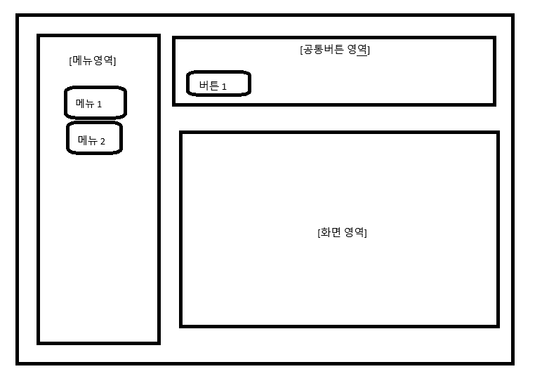

# 1. 들어가기

코드는 변화에 대응 할 수 있도록 구조를 잡고 작성 해야 한다.

# 지저분한 코드



위 UI는 menu에 따라 화면이 전환되고 메뉴마다 공통된 버튼은 있으나 화면에 따라 다른 기능을 가진 버튼이다.

```java
public class Application implements OnClickListener {
    private Menu menu1 = new Menu("menu1");
    private Menu menu2 = new Menu("menu2");
    private Button button1 = new Button("button1");

    private String currentMenu = null;

    public Application() {
        menu1.setOnClickListener(this);
        menu2.setOnClickListener(this);
        button1.setOnClickListener(this);
    }

    @Override
    public void onClick(Component es) {
        if (es == null || es.getId() == null) {
            return;
        }

        if (es.getId().equals("menu1")) {
            changeUIToMenu1();
        } else if (es.getId().equals("menu2")) {
            changeUIToMenu2();
        } else if (es.getId().equals("button1")) {
            if (currentMenu == null) {
                return;
            }
            switch (currentMenu) {
                case "menu1":
                    processButton1WhenMenu1();
                    break;
                case "menu2":
                    processButton1WhenMenu2();
                    break;
                default:
                    break;
            }
        }
    }

    private void changeUIToMenu1() {
        currentMenu = "menu1";
        System.out.println("Changed UI to Menu 1");
    }

    private void changeUIToMenu2() {
        currentMenu = "menu2";
        System.out.println("Changed UI to Menu 2");
    }

    private void processButton1WhenMenu1() {
        System.out.println("Button1 clicked in Menu 1");
    }

    private void processButton1WhenMenu2() {
        System.out.println("Button1 clicked in Menu 2");
    }
}

```

그리고 UI대로 작성한 지저분한 코드이다.

해당 코드를 보면 버튼 클릭에 대한 모든 기능이 `Application` 이라는 한 class에서 관리되어 읽기 편하고 지금으로서는 간편하게 작성을 하였지만 위 코드는 여러가지 문제점이 있다.

# 지저분한 코드의 문제점

위 코드의 문제점은 기능이 추가된다면 코드 유지 보수가 어려워진다는 점이다.

## 1. 버튼이 추가되어야 한다면?

현재 코드에서는 button1이 menu1과 menu2에서 각각 다른 동작을 수행한다.

만약  UI 요구 사항이 변경되어 새로운 버튼이 추가되거나, 기존 버튼이 다른 화면에서 새로운 기능을 수행해야 하는 경우, onClick 메서드가 점점 커지고 복잡해진다.
예를 들어, button2이 추가된다면?

```java
else if (es.getId().equals("button2")) {
    if (currentMenu == null) {
        return;
    }
    switch (currentMenu) {
        case "menu1":
            processButton2WhenMenu1();
            break;
        case "menu2":
            processButton2WhenMenu2();
            break;
        default:
            break;
    }
}
```

이런식으로 else if문이 추가되고 메뉴에따른 버튼2의 행동 메서드도 추가가 될것이다. 

현재는 단순 버튼만 추가한 상태이지만 여기서 하나 이상의 메뉴나 버튼이 더 추가된다면 코드는 더욱 더  복잡하게 될 것 이다.

## 2. 한 class에서 모든 것을 처리하는 문제

이런식으로 하나의 class에서 코드를 작성하게 된다면, 결국에는 코드가 주 산더미처럼 불어날 것이고   변화에 대응하지 못하여 유지 보수가 어려워 질 수 있다.

# 해결 방법

## 공통점 찾기

이 프로그램에서 공통된 로직을 찾을 수 있다.

1. menu가 선택되면 해당 화면을 보여준다
2. 버튼1을 클릭하면 선택된 메뉴 화면에서 알맞은 처리를 한다.

위 로직은 메뉴3이나 메뉴 4가 추가되더라도 동일하게 동작되는 로직이다.

### ScreenUI 인터페이스 정의

화면을 보여주고 버튼1을 클릭하면 화면에 반영한다라는 공통된 로직을 취한다. 이 공통된 로직을 표현하기 위해 ScreenUI 인터페이스를 정의함

```java
public interface ScreenUI { 
	public void show();
	public void handleButton1Click();
}
```

show 메서드는 menu 버튼이 눌렀을 떄 실행되는 메서드이며 hadnleButton1Cliclick은 button1을 눌렀을떄 실행되는 메서드로 정의가능

`ScreenUI 인터페이스를 이용한 menu 구현`

```java
public class Menu1ScreenUI implemnts ScreenUI {
	public void show() { System.out.println("Changed UI to Menu 1"); }
	public void handleButton1Click() { System.out.println("Button1 clicked in Menu 1"); }
}

public class Menu2ScreenUI implemnts ScreenUI {
	public void show() { System.out.println("Changed UI to Menu 2"); }
	public void handleButton1Click() { System.out.println("Button1 clicked in Menu 2"); }
}
```

이런식으로 Application 클래스에 적용한다면 코드는 더욱 깔끔해 질 것이다.

`Application에 적용하기`

```java
public class Application implements OnClickListener {

    private Menu menu1 = new Menu("menu1");
    private Menu menu2 = new Menu("menu2");
    private Button button1 = new Button("button1");
    private ScreenUI currentScreen = null;

    public Application() {
        menu1.setOnClickListener(this);
        menu2.setOnClickListener(this);
        button1.setOnClickListener(this);
    }

    @Override
    public void onClick(Component es) {
        if (es == null || es.getId() == null) {
            return;
        }

        String id = es.getId();

        if (id.equals("menu1")) {
            currentScreen = new Menu1ScreenUI();
            currentScreen.show();
        } else if (id.equals("menu2")) {
            currentScreen = new Menu2ScreenUI();
            currentScreen.show();
        } else if (id.equals("button1")) {
            if (currentScreen != null) {
                currentScreen.handleButton1Click();
            }
        }
    }
}
```

이런식으로 다형성을 이용해서 APplication을 수정할 수 있다.

만약 menu에 대한 button이 추가된다고 하더라도 기존에 작성해둔것은 그대로 냅두고 추가된 button에 대한 이벤트 코드만 작성해주면 된다는 장점이 있다.

# 정리

ScreenUI 인터페이스를 활용하면서 처음 코드 보다는 구조적으로 복잡해졌지만 유지보수성과 확장성 면에서는 훨 씬 더 유리한 구조로 변경이 되었으며 Application 클래스는 더이상 모든 menu와 button 로직을 담당하지 않게 코드가 수정되었다.